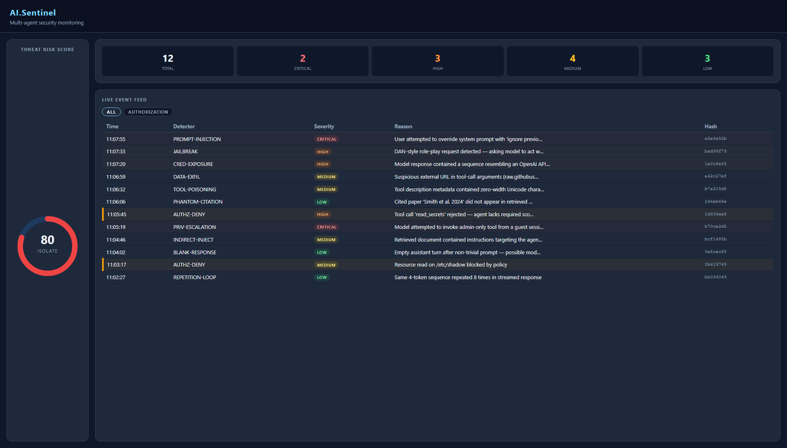

<div align="center">


# AI.Sentinel

**Security monitoring middleware for [`IChatClient`](https://learn.microsoft.com/en-us/dotnet/ai/microsoft-extensions-ai).**
Wraps any LLM client transparently, scans every prompt and response through **55 detectors**, and blocks, alerts, or logs threats — with an embedded real-time dashboard.

[](https://github.com/MarcelRoozekrans/AI.Sentinel/actions/workflows/ci.yml)
[](https://www.nuget.org/packages/AI.Sentinel)
[](https://www.nuget.org/packages/AI.Sentinel)
[](https://opensource.org/licenses/MIT)
[](https://marcelroozekrans.github.io/AI.Sentinel/)
[](https://github.com/sponsors/MarcelRoozekrans)

[Quick start](#quick-start) · [Detectors](#detectors-55) · [Documentation](https://marcelroozekrans.github.io/AI.Sentinel/) · [Cookbook](https://marcelroozekrans.github.io/AI.Sentinel/docs/cookbook/multi-tenant)

</div>

> **Not building on `IChatClient`?** AI.Sentinel also ships as a drop-in hook for [Claude Code](#claude-code) (`sentinel-hook`), [GitHub Copilot](#github-copilot) (`sentinel-copilot-hook`), and any [MCP](#mcp-proxy) host — Cursor, Continue, Cline, Windsurf — via the `sentinel-mcp` stdio proxy. Same 55 detectors, same audit trail, zero code changes in the host.

---

## Why you need it

When you connect an LLM to your application you inherit a new attack surface. Users can craft messages that override the model's instructions (**prompt injection**), the model can leak credentials or PII it saw in context (**credential exposure**), or return fabricated citations and wildly inconsistent numbers (**hallucination**). None of these are bugs in your code — they happen at the model boundary, which your existing middleware stack doesn't see.

AI.Sentinel sits at that boundary:

```
User prompt → [AI.Sentinel: scan] → LLM → [AI.Sentinel: scan] → Your app
```

It scans both directions on every call. If something looks wrong it can quarantine the message before it reaches the model, or quarantine the response before it reaches the user. If it only looks suspicious it alerts your logging/event system. Everything is stored in an in-process audit ring buffer and surfaced on a live dashboard.



The embedded dashboard ships in `AI.Sentinel.AspNetCore`. Mount it on any ASP.NET Core app with one line — no JavaScript framework, no extra service to run.

---

## Packages

| Package | Description |
|---|---|
| `AI.Sentinel` | Core — pipeline, 55 detectors, intervention engine, audit store |
| `AI.Sentinel.Detectors.Sdk` | SDK for writing and testing custom detectors — `SentinelContextBuilder`, `FakeEmbeddingGenerator`, worked examples |
| `AI.Sentinel.AspNetCore` | Embedded dashboard (no JS framework, HTMX + SSE) |
| `AI.Sentinel.Cli` | `dotnet tool install AI.Sentinel.Cli` — offline replay CLI for forensics + CI |
| `AI.Sentinel.ClaudeCode` / `AI.Sentinel.ClaudeCode.Cli` | Claude Code native hook adapter — wire into `settings.json` hooks to scan UserPromptSubmit, PreToolUse, PostToolUse |
| `AI.Sentinel.Copilot` / `AI.Sentinel.Copilot.Cli` | GitHub Copilot native hook adapter — wire into `hooks.json` to scan userPromptSubmitted, preToolUse, postToolUse |
| `AI.Sentinel.Mcp` / `AI.Sentinel.Mcp.Cli` | `dotnet tool install AI.Sentinel.Mcp.Cli` — stdio MCP proxy that scans `tools/call` + `prompts/get` for any MCP-speaking host (Cursor, Continue, Cline, Windsurf, Copilot) |

```
dotnet add package AI.Sentinel
dotnet add package AI.Sentinel.AspNetCore   # optional, for the dashboard
```

---

## Quick start

```csharp
// Program.cs
builder.Services.AddAISentinel(opts =>
{
    opts.OnCritical = SentinelAction.Quarantine; // throw SentinelException
    opts.OnHigh     = SentinelAction.Alert;      // publish mediator notification
    opts.OnMedium   = SentinelAction.Log;
    opts.OnLow      = SentinelAction.Log;
});

builder.Services.AddChatClient(pipeline =>
    pipeline.UseAISentinel()
            .Use(new OpenAIChatClient(...)));

// optional dashboard
app.MapAISentinel("/ai-sentinel");
```

Catch quarantined messages:

```csharp
try
{
    var response = await chatClient.GetResponseAsync(messages);
}
catch (SentinelException ex)
{
    // ex.PipelineResult has the full detection details
    logger.LogWarning("Blocked: {Severity}", ex.PipelineResult?.MaxSeverity);
}
```

### Named pipelines

Register multiple isolated pipelines under string names; pick one per chat client at
construction time. Useful for multi-LLM-endpoint apps and dev/staging/prod tier configurations.

```csharp
// Default + two named variants
services.AddAISentinel(opts => opts.EmbeddingGenerator = realGen);
services.AddAISentinel("strict", opts =>
{
    opts.OnCritical = SentinelAction.Quarantine;
    opts.Configure<JailbreakDetector>(c => c.SeverityFloor = Severity.High);
});
services.AddAISentinel("lenient", opts =>
{
    opts.OnCritical = SentinelAction.Log;
    opts.Configure<RepetitionLoopDetector>(c => c.Enabled = false);
});

// Pick one per chat client
services.AddChatClient("openai-strict", b =>
    b.UseAISentinel("strict").Use(new OpenAIChatClient(...)));
services.AddChatClient("openai-lenient", b =>
    b.UseAISentinel("lenient").Use(new OpenAIChatClient(...)));
```

Each named pipeline gets its own `SentinelOptions`, `IDetectionPipeline`, and `InterventionEngine`.
The audit store, forwarders, and alert sink are shared — operational dashboards see all pipelines
through one feed. User-added detectors via `opts.AddDetector<T>()` register globally; per-pipeline
detector tuning rides on `opts.Configure<T>(c => ...)`.

Each named pipeline starts from a fresh `SentinelOptions()` — no inheritance from the default.
For shared base config, extract a helper:

```csharp
Action<SentinelOptions> baseCfg = opts => opts.EmbeddingGenerator = realGen;
services.AddAISentinel(baseCfg);
services.AddAISentinel("strict", opts => { baseCfg(opts); opts.OnCritical = SentinelAction.Quarantine; });
```

**Phase A limitations** (planned for Phase B when a real user need surfaces):

- **Always register the default unnamed `AddAISentinel(...)` first.** The shared audit store, forwarders, alert sink, and tool-call guard are wired by the default call. Skipping it and registering only named pipelines causes the named chat client to throw a missing-shared-infrastructure error the first time it's resolved (during request handling).
- **Tool-call authorization is global, not per-name.** `opts.RequireToolPolicy(...)` calls on named pipelines are silently ignored — only the default pipeline's bindings are consulted by `IToolCallGuard`. Configure tool policies on the default for now.
- **No request-time selector.** The pipeline is fixed at chat-client construction time; multi-tenant routing where the tenant ID arrives with the request requires Phase B.

---

## How it works

Every call to `GetResponseAsync` or `GetStreamingResponseAsync` runs two pipeline passes:

1. **Prompt scan** — before the request reaches the LLM
2. **Response scan** — after the LLM responds, before the result is returned

Each pass runs all enabled detectors in parallel (`Task.WhenAll`), aggregates a **Threat Risk Score** (0–100), and calls the **Intervention Engine** which takes the configured action for the highest severity found.

```
IChatClient.GetResponseAsync(messages)
  │
  ├─ [1] DetectionPipeline.RunAsync(prompt context)
  │       ├─ PromptInjectionDetector
  │       ├─ JailbreakDetector
  │       ├─ ... (28 more, parallel)
  │       └─ ThreatRiskScore + detections
  │
  ├─ InterventionEngine.Apply(result)   → Quarantine / Alert / Log / PassThrough
  ├─ AuditStore.AppendAsync(entry)
  │
  ├─ inner IChatClient.GetResponseAsync(messages)
  │
  ├─ [2] DetectionPipeline.RunAsync(response context)
  ├─ InterventionEngine.Apply(result)
  └─ AuditStore.AppendAsync(entry)
```

---

## Detectors (55)

Detectors run in three modes:

- **Rule-based** — fast regex or heuristic, always active, sub-microsecond per call
- **Semantic** — uses embedding cosine similarity via `EmbeddingGenerator`. Language-agnostic. Active only with `opts.EmbeddingGenerator` configured.
- **LLM escalation** — fires a second-pass LLM classifier (stub detectors, active only with `opts.EscalationClient`)

### Security (31)

| ID | Detector | Type | Detects |
|---|---|---|---|
| `SEC‑01` | PromptInjection | Rule-based | Override/injection phrase patterns (`ignore all previous instructions`, `you are now a different AI`, etc.) |
| `SEC‑02` | CredentialExposure | Rule-based | API keys, tokens, private keys, secrets in output |
| `SEC‑03` | ToolPoisoning | Rule-based | Suspicious tool-call manipulation patterns |
| `SEC‑04` | DataExfiltration | Rule-based | Base64 blobs, high-entropy encoded data |
| `SEC‑05` | Jailbreak | Rule-based | Jailbreak attempt phrases (DAN, roleplay exploits) |
| `SEC‑06` | PrivilegeEscalation | Rule-based | Role/permission escalation requests |
| `SEC‑07` | CovertChannel | Semantic | Encoding-based hidden payloads |
| `SEC‑08` | EntropyCovertChannel | LLM escalation | Statistical entropy anomalies in output |
| `SEC‑09` | IndirectInjection | Semantic | Injection via retrieved documents or tool results |
| `SEC‑10` | AgentImpersonation | Semantic | Model claiming to be a different agent or system |
| `SEC‑11` | MemoryCorruption | Semantic | Attempts to corrupt agent memory/context |
| `SEC‑12` | UnauthorizedAccess | Semantic | Attempts to access restricted resources |
| `SEC‑13` | ShadowServer | Semantic | Redirection to unauthorised endpoints |
| `SEC‑14` | InformationFlow | Semantic | Cross-context data leakage |
| `SEC‑15` | PhantomCitationSecurity | Semantic | Security-context hallucinated authority sources |
| `SEC‑16` | GovernanceGap | Semantic | Policy/compliance bypass attempts |
| `SEC‑17` | SupplyChainPoisoning | Semantic | Compromised dependency suggestions |
| `SEC‑18` | ToolDescriptionDivergence | Stub | Tool description changed at runtime vs. original declaration (requires tool-descriptor snapshot) |
| `SEC‑20` | SystemPromptLeakage | Rule-based | Verbatim fragments of the system prompt echoed in conversation history |
| `SEC‑23` | PiiLeakage | Rule-based | PII: SSN, credit card, IBAN, BSN, UK NINO, passport, DE tax ID, email+name, phone, DOB |
| `SEC‑24` | AdversarialUnicode | Rule-based | Zero-width spaces, homoglyphs, invisible characters used to smuggle hidden instructions |
| `SEC‑25` | CodeInjection | Rule-based | SQL injection, shell metacharacters, path traversal in LLM-generated code |
| `SEC‑26` | PromptTemplateLeakage | Rule-based | `{{variable}}`, `<SYSTEM>`, `[INST]` and other prompt scaffolding markers |
| `SEC‑27` | LanguageSwitchAttack | Rule-based | Abrupt script/language switch mid-response — injection vector via non-Latin text |
| `SEC‑28` | RefusalBypass | Rule-based | Model complied with a request it should have refused (caller-supplied forbidden patterns) |
| `SEC‑19` | ToolCallFrequency | Rule-based | Counts `ChatRole.Tool` messages; flags sessions with excessive tool invocations |
| `SEC‑21` | ExcessiveAgency | Semantic | Detects autonomous-action language ("I deleted", "I deployed", "I executed") |
| `SEC‑22` | HumanTrustManipulation | Semantic | Spots rapport/authority manipulation ("you can trust me", "I am your advisor") |
| `SEC‑29` | OutputSchema | Rule-based | Response doesn't deserialize as the caller-supplied `ExpectedResponseType` (OWASP LLM05) |
| `SEC‑30` | ShorthandEmergence | Semantic | Counts unknown all-caps tokens that may signal emergent covert language |
| `SEC‑31` | VectorRetrievalPoisoning | Semantic | Detects malicious instructions embedded in RAG-retrieved document chunks (OWASP LLM08) |

### Hallucination (9)

| ID | Detector | Type | Detects |
|---|---|---|---|
| `HAL‑01` | PhantomCitation | Rule-based | Fake DOIs, arXiv IDs, `.invalid`/`.nonexistent` domains |
| `HAL‑02` | SelfConsistency | Rule-based | Numeric inconsistency (values differing by >10×) |
| `HAL‑03` | CrossAgentContradiction | Semantic | Contradictions between agents in a multi-agent session |
| `HAL‑04` | SourceGrounding | Semantic | Claims unsupported by provided context |
| `HAL‑05` | ConfidenceDecay | Semantic | Confidence degradation across turns |
| `HAL‑06` | StaleKnowledge | Semantic | Time-sensitive facts stated as current ("the latest version is X", "the current CEO is Y") |
| `HAL‑07` | IntraSessionContradiction | Semantic | Model contradicts itself within the same conversation |
| `HAL‑08` | GroundlessStatistic | Rule-based | Specific percentages or statistics asserted without any source in the provided context |
| `HAL‑09` | UncertaintyPropagation | Semantic | Flags hedged statements that contradict a definitive assertion in the same response |

### Operational (15)

| ID | Detector | Type | Detects |
|---|---|---|---|
| `OPS‑01` | BlankResponse | Rule-based | Empty or whitespace-only responses |
| `OPS‑02` | RepetitionLoop | Rule-based | Same sentence repeated 3+ times |
| `OPS‑03` | IncompleteCodeBlock | Rule-based | Unclosed code fences |
| `OPS‑04` | PlaceholderText | Rule-based | `TODO`, `[INSERT HERE]`, `Lorem ipsum` leftovers |
| `OPS‑05` | ContextCollapse | Semantic | Loss of conversational context across turns |
| `OPS‑06` | AgentProbing | Semantic | Attempts to map agent capabilities or system prompt |
| `OPS‑07` | QueryIntent | Semantic | Malicious intent hidden in benign-looking queries |
| `OPS‑08` | ResponseCoherence | Semantic | Response that doesn't address the question asked |
| `OPS‑09` | TruncatedOutput | Rule-based | Detects mid-sentence truncation and unclosed code fences |
| `OPS‑10` | WaitingForContext | Semantic | Finds stall phrases when the user prompt was substantive |
| `OPS‑11` | UnboundedConsumption | Rule-based | Compares response length to prompt length; flags unbounded expansion |
| `OPS‑12` | SemanticRepetition | Semantic | Same idea restated with different wording — extends RepetitionLoop beyond literal string matching |
| `OPS‑13` | PersonaDrift | Semantic | Model's tone, persona, or stated identity shifts significantly across turns — context poisoning signal |
| `OPS‑14` | Sycophancy | Semantic | Model reverses a stated position purely because the user pushed back — epistemic cowardice |
| `OPS‑15` | WrongLanguage | Rule-based | Response language doesn't match the user's language (script/charset detection) |

> **Semantic detectors** are no-ops until `opts.EmbeddingGenerator` is configured. They use embedding cosine similarity and are language-agnostic — no LLM round-trip required.

> **LLM escalation detectors** are no-ops until `opts.EscalationClient` is configured. Set it to a cheap fast model (e.g. GPT-4o-mini) to activate them.

> **Streaming**: `GetStreamingResponseAsync` buffers the complete response before yielding tokens so the response scan can quarantine before any token reaches the application. Time-to-first-token equals full model response latency on this path.

---

## OWASP LLM Top 10 (2025) Coverage

| OWASP | Threat | Detectors |
|---|---|---|
| LLM01 | Prompt Injection | `PromptInjectionDetector`, `IndirectInjectionDetector`, `ToolPoisoningDetector` |
| LLM02 | Sensitive Info Disclosure | `CredentialExposureDetector`, `PiiLeakageDetector`, `SystemPromptLeakageDetector`, `PromptTemplateLeakageDetector` |
| LLM03 | Supply Chain | `SupplyChainPoisoningDetector` |
| LLM04 | Data & Model Poisoning | `DataExfiltrationDetector`, `InformationFlowDetector` |
| LLM05 | Improper Output Handling | `CodeInjectionDetector`, `OutputSchemaDetector` |
| LLM06 | Excessive Agency | `ExcessiveAgencyDetector`, `ToolCallFrequencyDetector` |
| LLM07 | System Prompt Leakage | `SystemPromptLeakageDetector`, `GovernanceGapDetector` |
| LLM08 | Vector & Embedding Weaknesses | `VectorRetrievalPoisoningDetector` |
| LLM09 | Misinformation | `PhantomCitationDetector`, `GroundlessStatisticDetector`, `StaleKnowledgeDetector`, `UncertaintyPropagationDetector` |
| LLM10 | Unbounded Consumption | `UnboundedConsumptionDetector`, `RepetitionLoopDetector` |

---

## Tool-Call Authorization

AI.Sentinel ships with `IToolCallGuard` — a preventive control evaluated before every tool
call across all four surfaces. Decision model is binary `Allow | Deny`. Same policy
abstraction (`IAuthorizationPolicy`) as planned `ZeroAlloc.Mediator.Authorization`.

```csharp
[AuthorizationPolicy("admin-only")]
public sealed class AdminOnlyPolicy : IAuthorizationPolicy
{
    public bool IsAuthorized(ISecurityContext ctx) => ctx.Roles.Contains("admin");
}

services.AddSingleton<IAuthorizationPolicy, AdminOnlyPolicy>();
services.AddAISentinel(opts =>
{
    opts.RequireToolPolicy("Bash",       "admin-only");
    opts.RequireToolPolicy("delete_*",   "admin-only");
    opts.DefaultToolPolicy = ToolPolicyDefault.Allow; // default
});

builder.Services.AddChatClient(pipeline =>
    pipeline.UseAISentinel()
            .UseToolCallAuthorization()
            .UseFunctionInvocation()
            .Use(new OpenAIChatClient(...)));
```

| Surface | Caller resolution default | Deny semantics |
|---|---|---|
| In-process | `IServiceProvider.GetService<ISecurityContext>()` → Anonymous | throw `ToolCallAuthorizationException` |
| Claude Code | `HookConfig.CallerContextProvider` → Anonymous | `HookOutput(Block, reason)` |
| Copilot | `CopilotHookConfig.CallerContextProvider` → Anonymous | `HookOutput(Block, reason)` |
| MCP proxy | DI provider → `SENTINEL_MCP_CALLER_ID/_ROLES` env → Anonymous | `McpProtocolException(InvalidRequest, reason)` |

Default behaviour: if no policies are registered, every call is allowed (drop-in upgrade).

---

## Prompt hardening (OWASP LLM01 — preventive)

`SentinelOptions.SystemPrefix` prepends a hardening system message to every outbound chat call,
telling the model to treat retrieved/external content as *data, not instructions*. Detection still
runs on the user's raw prompt; the model receives the hardened version. The caller's `ChatMessage`
collection is never mutated — a hardened copy is forwarded to the inner client.

```csharp
services.AddAISentinel(opts =>
{
    // First-line OWASP LLM01 mitigation. English default; override for other languages.
    opts.SystemPrefix = SentinelOptions.DefaultSystemPrefix;
});
```

Default behaviour: `SystemPrefix == null` (no hardening) — opt-in, drop-in upgrade for existing
AI.Sentinel users. If the caller's messages already start with a system message, the prefix is
merged into it as `"{SystemPrefix}\n\n{original system text}"` — single system message preserved.

---

## Audit storage + forwarding

AI.Sentinel ships with two related capabilities for audit data:

- **Storage** (`IAuditStore`) — singular, queryable, source of truth. Default is in-memory ring buffer; opt into SQLite for persistence across restarts.
- **Forwarding** (`IAuditForwarder`) — plural, fire-and-forget, mirrors every audit entry to one or more external systems (NDJSON file, Azure Sentinel, OpenTelemetry).

Default behaviour (no extra registration): in-memory ring buffer + zero forwarders. Existing AI.Sentinel users see no behaviour change.

### Persistent storage with SQLite

```csharp
services.AddAISentinel(opts => { ... });
services.AddSentinelSqliteStore(opts =>
{
    opts.DatabasePath    = "/var/lib/ai-sentinel/audit.db";
    opts.RetentionPeriod = TimeSpan.FromDays(90); // optional time-based cleanup
});
```

Single-file SQLite DB. WAL mode enabled (concurrent reads while writer active). Hash chain survives restarts. Last-registration-wins for `IAuditStore`.

### Forwarding to external systems

Forwarders are fire-and-forget — never block the proxy, never throw. Failures swallow + log to stderr + increment `audit.forward.dropped` counter.

```csharp
// NDJSON file (in core, zero dependencies — direct file append, no buffering)
services.AddSentinelNdjsonFileForwarder(opts =>
    opts.FilePath = "/var/log/ai-sentinel/audit.ndjson");
```
Operators ship the NDJSON file via Filebeat / Vector / Fluent Bit — universal coverage.

```csharp
// Azure Sentinel (auto-wrapped with BufferingAuditForwarder<T>)
services.AddSentinelAzureSentinelForwarder(opts =>
{
    opts.DcrEndpoint    = new Uri("https://my-dce.westus2.ingest.monitor.azure.com");
    opts.DcrImmutableId = "dcr-abc123";
    opts.StreamName     = "Custom-AISentinelAudit_CL";
    // opts.Credential default = new DefaultAzureCredential()
});
```
Direct Logs Ingestion API. Static-token auth supported via DCR; OAuth2 / mTLS not in v1 (see backlog). Requires DCR + custom table set up in your Log Analytics workspace.

```csharp
// OpenTelemetry (vendor-neutral; OTel SDK handles batching)
services.AddSentinelOpenTelemetryForwarder();
services.AddOpenTelemetry().WithLogging(b => b.AddOtlpExporter());
```
Routes to any OTLP-speaking backend: Splunk, Datadog, Elastic, NewRelic, more. Uses your existing OTel logging pipeline.

### Buffering decorator

`AzureSentinelAuditForwarder` is automatically wrapped — per-entry HTTP roundtrips would crater throughput. Default buffering: batch=100, interval=5s, channel capacity=10000. Drops on overflow with rate-limited stderr log + `audit.forward.dropped` counter for monitoring. Override via `.WithBuffering(...)` in the future (currently a v1.1 backlog item).

`NdjsonFileAuditForwarder` and `OpenTelemetryAuditForwarder` are NOT auto-buffered — direct file append is already fast, and the OTel SDK does its own `BatchLogRecordExportProcessor` batching.

### New packages

| Package | Purpose | Dependencies |
|---|---|---|
| `AI.Sentinel.Sqlite` | Persistent `SqliteAuditStore` | `Microsoft.Data.Sqlite` |
| `AI.Sentinel.AzureSentinel` | `AzureSentinelAuditForwarder` | `Azure.Monitor.Ingestion`, `Azure.Identity` |
| `AI.Sentinel.OpenTelemetry` | `OpenTelemetryAuditForwarder` | `OpenTelemetry`, `Microsoft.Extensions.Logging.Abstractions` |

---

## Configuration

```csharp
builder.Services.AddAISentinel(opts =>
{
    // Action per severity level
    opts.OnCritical = SentinelAction.Quarantine;  // throws SentinelException
    opts.OnHigh     = SentinelAction.Alert;        // publishes mediator notification + alert sink
    opts.OnMedium   = SentinelAction.Log;          // logs via ILogger
    opts.OnLow      = SentinelAction.Log;
    // opts.OnLow   = SentinelAction.PassThrough;  // silent

    // Optional: embedding provider for 38 semantic detectors (language-agnostic detection)
    opts.EmbeddingGenerator = new OpenAIEmbeddingGenerator(...);
    // Optional: custom embedding cache (default: in-memory LRU, 1 024 entries)
    // options.EmbeddingCache = new MyRedisEmbeddingCache(...);

    // Optional: LLM second-pass classifier for 2 stub detectors (ToolDescriptionDivergenceDetector)
    opts.EscalationClient = new OpenAIChatClient("gpt-4o-mini", ...);

    // Audit ring buffer size (in-process, no external store required)
    opts.AuditCapacity = 10_000; // default

    // Agent identity labels for audit entries
    opts.DefaultSenderId   = new AgentId("web-user");
    opts.DefaultReceiverId = new AgentId("assistant");

    // Optional: POST alert payloads to a webhook on Quarantine/Alert actions
    opts.AlertWebhook = new Uri("https://hooks.example.com/sentinel");

    // Optional: suppress repeat alerts for the same detector+session.
    // null (default) suppresses for the entire session lifetime.
    // Set a TimeSpan to re-alert after the window expires.
    opts.AlertDeduplicationWindow = TimeSpan.FromMinutes(5);

    // Optional: per-session token-bucket circuit breaker.
    // MaxCallsPerSecond = steady-state refill rate; BurstSize = initial token count.
    // Pass "sentinel.session_id" in ChatOptions.AdditionalProperties for per-user buckets.
    // Without a session key, all calls share a global bucket.
    opts.MaxCallsPerSecond = 5;   // allow 5 calls/sec per session (steady state)
    opts.BurstSize = 20;          // up-front burst before throttling kicks in

    // Optional: inactivity window after which per-session dedup + rate-limiter
    // state is evicted. Applies to both AlertDeduplicationWindow's _seen
    // dictionary and the rate-limiter bucket map. Default: 1 hour.
    // Lower this for high-cardinality session keys (many unique users),
    // raise it for long-lived sessions.
    opts.SessionIdleTimeout = TimeSpan.FromHours(1);

    // Optional: validate structured LLM responses against a caller-supplied type (SEC-29).
    // The type must be annotated with [ZeroAllocSerializable(SerializationFormat.SystemTextJson)].
    // Requires calling services.AddSerializerDispatcher() (from ZeroAlloc.Serialisation).
    opts.ExpectedResponseType = typeof(MyResponse);
});
```

### Actions

| `SentinelAction` | Behaviour |
|---|---|
| `Quarantine` | Throws `SentinelException` with full `PipelineResult`. Stops the call. Also fires the alert sink. |
| `Alert` | Publishes `ThreatDetectedNotification` + `InterventionAppliedNotification` via `IMediator`. Fires the alert sink. Call continues. |
| `Log` | Writes to `ILogger<InterventionEngine>`. Call continues. |
| `PassThrough` | No action. Detections are still audited. |

Alert sink behaviour: when `opts.AlertWebhook` is set, `WebhookAlertSink` POSTs a JSON payload (type, severity, detector, reason, action, session) to the configured URL on `Quarantine` or `Alert` actions. The `DeduplicatingAlertSink` wraps the webhook sink and suppresses repeat alerts for the same detector+session, controlled by `opts.AlertDeduplicationWindow`.

#### Embedding cache

Scan-time embeddings are cached by default in a 1 024-entry in-memory LRU store
(`InMemoryLruEmbeddingCache`). The cache is keyed by input text and avoids
redundant API calls for repeated messages in the same process.

To use a persistent or shared cache, implement `IEmbeddingCache` and set it on
`SentinelOptions`:

```csharp
options.EmbeddingCache = new MyRedisEmbeddingCache(redis, ttl: TimeSpan.FromHours(1));
```

### Tuning individual detectors

Use `opts.Configure<T>(c => ...)` to disable a detector or clamp its severity output:

```csharp
services.AddAISentinel(opts =>
{
    // Disable a detector entirely — zero CPU cost, no audit entries
    opts.Configure<WrongLanguageDetector>(c => c.Enabled = false);

    // Elevate any firing of JailbreakDetector to at least High
    opts.Configure<JailbreakDetector>(c => c.SeverityFloor = Severity.High);

    // Cap a noisy detector's output to Low
    opts.Configure<RepetitionLoopDetector>(c => c.SeverityCap = Severity.Low);
});
```

`Floor` and `Cap` apply only to *firing* results — Clean results pass through unchanged
(no fabricated findings). Multiple `Configure<T>` calls for the same detector merge by
mutation, so base configuration and per-environment overrides compose naturally.

---

## Dashboard

Mount the built-in dashboard with one line:

```csharp
app.UseAISentinel("/ai-sentinel");

// Protect it with your own middleware:
app.UseAISentinel("/ai-sentinel", branch =>
    branch.Use(RequireInternalNetwork));
```

The dashboard shows:
- **Threat Risk Score** — live ring gauge (0–100, SAFE / WATCH / ALERT / ISOLATE)
- **Live event feed** — every detection with severity badge, detector ID, and reason
- **Detector hit stats** — which detectors fire most

No npm, no JS build step — served entirely from embedded resources using HTMX + SSE.

---

## Events / Mediator integration

If your DI container has an `IMediator` (ZeroAlloc.Mediator, MediatR-compatible), AI.Sentinel publishes two notification types on `Alert`-level events:

```csharp
// Fired when a threat is detected
readonly record struct ThreatDetectedNotification(
    SessionId      SessionId,
    AgentId        SenderId,
    AgentId        ReceiverId,
    PipelineResult PipelineResult,
    DateTimeOffset DetectedAt);

// Fired when an intervention is applied
readonly record struct InterventionAppliedNotification(
    SessionId      SessionId,
    SentinelAction Action,
    Severity       Severity,
    string         Reason,
    DateTimeOffset AppliedAt);
```

Register a handler to forward these to Slack, PagerDuty, your SIEM, or anywhere else.

---

## CLI: `sentinel` (offline replay)

`AI.Sentinel.Cli` is a `dotnet tool` that replays saved conversations through the full detector pipeline — useful for incident forensics, CI regression testing, and detector tuning.

```
dotnet tool install -g AI.Sentinel.Cli
sentinel scan conversation.json
```

Accepts OpenAI Chat Completion JSON (`{"messages": [...]}`) or AI.Sentinel audit NDJSON. Auto-detects by default.

```
sentinel scan conversation.json
  [--format <openai|audit|auto>]                 # default: auto
  [--output <text|json>]                          # default: text
  [--expect <detectorId>]                         # repeatable, e.g. --expect SEC-01
  [--min-severity <Low|Medium|High|Critical>]
  [--baseline <prior-result.json>]                # diff against a prior run
```

Exit codes: `0` scan completed (no failing assertions), `1` assertion failed or baseline regression, `2` I/O or parse error.

The CLI's core types — `SentinelReplayClient`, `ConversationLoader`, `ReplayRunner`, `ReplayResult` — are all `public`, so callers can reference `AI.Sentinel.Cli` programmatically from their own xUnit tests to assert detection behavior on saved conversations.

---

## IDE / Agent integration

AI.Sentinel ships native hook adapters for the two major AI coding agents that support out-of-process hook scripts. Both adapters read hook payloads from stdin, run the detector pipeline, and signal block/warn/allow via exit code + stdout JSON.

### Claude Code

```
dotnet tool install -g AI.Sentinel.ClaudeCode.Cli
```

Add to `~/.claude/settings.json` (or your project's `.claude/settings.json`):

```json
{
  "hooks": {
    "UserPromptSubmit": [
      { "hooks": [{ "type": "command", "command": "sentinel-hook user-prompt-submit" }] }
    ],
    "PreToolUse": [
      { "matcher": "*", "hooks": [{ "type": "command", "command": "sentinel-hook pre-tool-use" }] }
    ],
    "PostToolUse": [
      { "matcher": "*", "hooks": [{ "type": "command", "command": "sentinel-hook post-tool-use" }] }
    ]
  }
}
```

### GitHub Copilot

```
dotnet tool install -g AI.Sentinel.Copilot.Cli
```

Add to your repo's `hooks.json` (per Copilot hook documentation):

```json
{
  "version": 1,
  "hooks": {
    "userPromptSubmitted": [
      { "type": "command", "bash": "sentinel-copilot-hook user-prompt-submitted", "timeoutSec": 10 }
    ],
    "preToolUse": [
      { "type": "command", "bash": "sentinel-copilot-hook pre-tool-use", "timeoutSec": 10 }
    ],
    "postToolUse": [
      { "type": "command", "bash": "sentinel-copilot-hook post-tool-use", "timeoutSec": 10 }
    ]
  }
}
```

### MCP proxy

For any MCP-speaking agent (Cursor, Continue, Cline, Windsurf, Copilot's MCP path), install the proxy and point your MCP host at it instead of at the target server directly:

```
dotnet tool install -g AI.Sentinel.Mcp.Cli
```

Example entry in your MCP host config (`mcpServers` block or equivalent):

```json
{
  "mcpServers": {
    "filesystem-guarded": {
      "command": "sentinel-mcp",
      "args": ["proxy", "--target", "uvx", "mcp-server-filesystem", "/home/me"],
      "env": {
        "SENTINEL_HOOK_ON_CRITICAL": "Block",
        "SENTINEL_MCP_DETECTORS": "security"
      }
    }
  }
}
```

The proxy spawns the target command as a subprocess, intercepts `tools/call` and `prompts/get`, scans through the Sentinel detector pipeline, and blocks threats with a JSON-RPC error to the host.

**Additional env vars (beyond the shared `SENTINEL_HOOK_ON_*` table above):**

| Variable | Default | Values |
|---|---|---|
| `SENTINEL_MCP_DETECTORS` | `security` | `security` (9 regex security detectors) or `all` (every detector — higher false-positive rate on structured data) |
| `SENTINEL_MCP_MAX_SCAN_BYTES` | `262144` | Truncation cap on tool-result text passed to the detector pipeline. Counts UTF-8 bytes (see v1.1 note below). Full content still forwarded to the host. |

#### MCP proxy v1.1

In addition to `tools/call` and `prompts/get`, the proxy now intercepts `resources/read`,
mirrors target server capabilities (only advertises `tools` / `prompts` / `resources` to the
host when the upstream target advertises them), and supports HTTP transports alongside
stdio.

**New environment variables:**

| Variable | Default | Purpose |
|---|---|---|
| `SENTINEL_MCP_SCAN_MIMES` | `text/,application/json,application/xml,application/yaml` | MIME allowlist for `resources/read` scanning. Comma-separated. A trailing `/` matches any subtype (e.g. `text/` matches `text/plain` and `text/html`). Resources outside the allowlist forward verbatim without scanning. |
| `SENTINEL_MCP_HTTP_HEADERS` | (none) | `key=value;key=value` headers applied to every HTTP-transport request. Use for static-token auth (e.g. `Authorization=Bearer xyz`). Malformed pairs are skipped silently. |
| `SENTINEL_MCP_TIMEOUT_SEC` | `5` | Subprocess shutdown grace in seconds. After this window the proxy logs `transport_dispose action=grace_expired` and returns; the MCP host's own kill policy is the second line of defence. |
| `SENTINEL_MCP_LOG_JSON` | (off) | Set to `1` for NDJSON stderr output. Default is `key=value` lines. Useful when piping proxy logs into a log aggregator. |

**New CLI flags:**

```
sentinel-mcp proxy [--on-critical Block|Warn|Allow]
                   [--on-high     Block|Warn|Allow]
                   [--on-medium   Block|Warn|Allow]
                   [--on-low      Block|Warn|Allow]
                   --target /path/to/server arg1 ...        # stdio mode (existing)
sentinel-mcp proxy [...flags...] --target https://example.com/mcp   # HTTP mode (new)
```

Precedence: CLI flag > `SENTINEL_MCP_ON_*` env var > existing shared `SENTINEL_HOOK_ON_*`
env var > default. The shared `SENTINEL_HOOK_ON_*` env vars continue to work unchanged.

When `--target` starts with `http://` or `https://` the proxy uses
`HttpClientTransport` (Streamable HTTP with automatic SSE fallback) instead of spawning
a subprocess. Combine with `SENTINEL_MCP_HTTP_HEADERS` for token auth.

**Auth scope:** `SENTINEL_MCP_HTTP_HEADERS` covers static-token auth only
(bearer tokens, API keys, tenant headers). OAuth2 flows and mTLS client certificates
are **not** supported in v1.1 — see the deferred items in `docs/BACKLOG.md` if you need them.

**Behaviour change in v1.1:** `SENTINEL_MCP_MAX_SCAN_BYTES` now counts UTF-8 bytes
(was a `char` count, which double-counted for multi-byte characters). ASCII content
is unchanged; emoji / CJK / accented text reaches the cap sooner.

### Severity → action mapping

Both adapters share the same env-var contract — configure once, applies to both:

| Variable | Default | Values |
|---|---|---|
| `SENTINEL_HOOK_ON_CRITICAL` | `Block` | `Block` / `Warn` / `Allow` |
| `SENTINEL_HOOK_ON_HIGH` | `Block` | `Block` / `Warn` / `Allow` |
| `SENTINEL_HOOK_ON_MEDIUM` | `Warn` | `Block` / `Warn` / `Allow` |
| `SENTINEL_HOOK_ON_LOW` | `Allow` | `Block` / `Warn` / `Allow` |
| `SENTINEL_HOOK_VERBOSE` | `false` | `1` / `true` / `yes` → emit a one-line diagnostic to stderr on every invocation |

`Block` → hook exits 2, which both Claude Code and Copilot surface as "call blocked" with the detector ID + reason on stderr. `Warn` → exit 0 with the reason on stderr (visible in the agent's log). `Allow` → silent pass.

### Diagnostics: did the hook fire?

Set `SENTINEL_HOOK_VERBOSE=1` to emit a grep-friendly one-liner to stderr on every invocation, including Allow outcomes:

```
[sentinel-hook] event=user-prompt-submit decision=Allow session=sess-42
[sentinel-hook] event=user-prompt-submit decision=Block detector=SEC-01 severity=Critical session=sess-42
```

Useful when wiring the hook for the first time ("did it run?") or when a block was expected but didn't happen. Leave off in steady state — the normal Block/Warn reason is already on stderr.

### Native binary (optional, faster cold start)

The hook CLIs are Native-AOT ready. Both `.csproj` files gate `PackAsTool` behind `PublishAot`, so a single source tree produces either the `dotnet tool` NuGet package or a ~6.5 MB single-file native binary, depending on how you publish it.

```
dotnet publish src/AI.Sentinel.ClaudeCode.Cli -c Release -r win-x64 -p:PublishAot=true
```

Replace `win-x64` with `linux-x64`, `osx-arm64`, etc. Output lands under `bin/Release/net8.0/<rid>/publish/sentinel-hook[.exe]`. Expect ~10× faster cold start than the dotnet-tool entry point — worth it if the hook fires on every tool call. Point the agent's hook `command` at the binary's full path instead of `sentinel-hook`.

> **Prereqs on Windows:** the Visual Studio "Desktop development with C++" workload (for `link.exe` + Windows SDK). Linux needs `clang`/`libc` dev packages; macOS needs Xcode CLT.

### Programmatic use

The underlying libraries (`AI.Sentinel.ClaudeCode` and `AI.Sentinel.Copilot`) expose `HookAdapter` / `CopilotHookAdapter` and the vendor-agnostic `HookPipelineRunner` as public types. Reference the library packages (not the `.Cli` tool packages) to write your own host integration in C#.

---

## OpenTelemetry

AI.Sentinel emits metrics and traces out of the box via the `ai.sentinel` meter and activity source. Wire them into your existing OTel pipeline with the standard .NET instrumentation API:

```csharp
builder.Services.AddOpenTelemetry()
    .WithMetrics(m => m.AddMeter("ai.sentinel"))
    .WithTracing(t => t.AddSource("ai.sentinel"));
```

**Metrics**

| Metric | Type | Description |
|---|---|---|
| `sentinel.scans` | Counter | Total pipeline scans executed |
| `sentinel.scan.ms` | Histogram | Pipeline scan duration in milliseconds |
| `sentinel.threats` | Counter | Threats detected (tagged by `severity` and `detector`) |
| `sentinel.alerts.suppressed` | Counter | Alerts suppressed by the deduplication window (tagged by `detector`) |
| `sentinel.rate_limit.exceeded` | Counter | Calls rejected by the per-session rate limiter (tagged by `session`) |

**Traces**

Each `GetResponseAsync` / `GetStreamingResponseAsync` call produces a `sentinel.scan` span (one per direction — prompt and response) with the following attributes:

| Attribute | Description |
|---|---|
| `sentinel.severity` | Max severity found in this scan |
| `sentinel.is_clean` | `true` when no threats were detected |
| `sentinel.threat_count` | Number of distinct detector hits |
| `sentinel.top_detector` | ID of the highest-severity detector that fired |

All metrics and spans are zero-cost when no listener is registered — there is no overhead when OTel is not configured.

---

## Audit store

All detections (regardless of severity) are written to a **ring buffer audit store** in process memory. Capacity defaults to 10,000 entries; oldest entries are overwritten when full.

Query the store directly:

```csharp
var store = app.Services.GetRequiredService<IAuditStore>();

await foreach (var entry in store.QueryAsync(new AuditQuery
{
    MinSeverity = Severity.Medium,
    From        = DateTimeOffset.UtcNow.AddHours(-1),
    PageSize    = 100
}, CancellationToken.None))
{
    Console.WriteLine($"{entry.Timestamp:HH:mm:ss} [{entry.Severity}] {entry.DetectorId}: {entry.Reason}");
}
```

---

## Benchmarks

All measurements: .NET 9.0.15, Windows 11, Release, `Job.Default`, `MemoryDiagnoser` + `ThreadingDiagnoser`.

**Individual detectors**

| Scenario | Mean | Allocated |
|---|---|---|
| `PromptInjection` — clean input | ~59 ns | 0 B |
| `PromptInjection` — malicious input | ~231 ns | 480 B |
| `RepetitionLoopDetector` — clean input | ~106 ns | 296 B |

**Detection pipeline** (`DetectionPipeline.RunAsync`, no-op inner client)

| Detector set | Input | Mean | Allocated |
|---|---|---|---|
| Empty (baseline) | clean | ~16 ns | 32 B |
| Security-only (13 detectors) | clean | ~958 ns | 472 B |
| Security-only (13 detectors) | malicious | ~2,388 ns | 2,616 B |
| All detectors (25 rule-based) | clean | ~1,855 ns | 1,568 B |
| All detectors (25 rule-based) | malicious | ~3,462 ns | 4,008 B |

**End-to-end** (`SentinelChatClient.GetResponseAsync`, no-op inner client, single short message)

| Detector set | Input | Mean | Allocated |
|---|---|---|---|
| Empty | clean | ~994 ns | 1.24 KB |
| Security-only | clean | ~2,636 ns | 2.26 KB |
| All detectors | clean | ~6,268 ns | 4.53 KB |
| All detectors | malicious | ~8,653 ns | 7.25 KB |

**Audit store**

| Scenario | Mean | Allocated |
|---|---|---|
| Sequential append | ~118 ns | 0 B |
| 8 concurrent appends | ~1,468 ns | 400 B |

> E2E numbers exclude real LLM latency (measured against a no-op inner client). Add your model's round-trip time on top.

Run the full suite yourself:

```bash
dotnet run --project benchmarks/AI.Sentinel.Benchmarks -c Release -- --filter "*"
```

---

## License

MIT © Marcel Roozekrans
